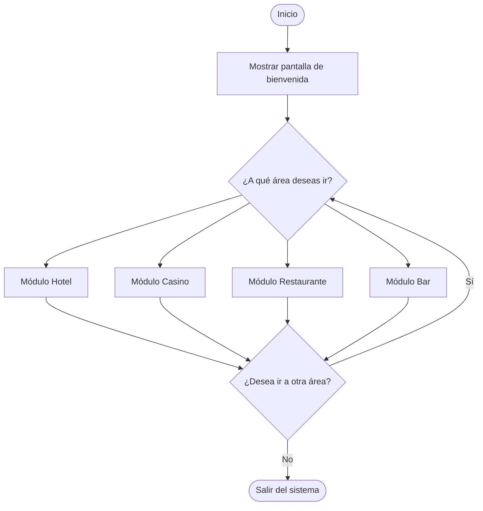

<div align="center">
  
  <h1>ElecentroLand</h1>
</div>

Este es el proyecto que estamos escribiendo Las Víctimas de Elecentro para Algoritmos I. Consiste en un sistema de reservación para un hotel, un casino virtual (con posibles aplicaciones a un casino real), un restaurante con inventario y sistema de reservaciones, y un barcito para que puedas ir a llorar y beber después de reprobar matemáticas. Dicho sistema está pensado para implementarse en la ciudad de San Juan de los Morros, ubicada en el estado Guárico, Venezuela.

Este proyecto surgió a partir de la tradicional quema anual de sedes de Elecentro de San Juan. Viendo el potencial turístico y económico, nosotros como equipo decidimos aprovechar nuestro ingenio y capacidades para hacer algo que pueda significativamente aumentar el valor de la zona (y darnos plata, ¿por qué no?)

## Sobre la finalidad de este repositorio

Este repositorio ha servido como herramienta de colaboración durante el desarrollo del proyecto (lo cual se puede ver en el [historial de commits](https://github.com/RicJDev/ElecentroLand/commits/master/)), lo que demuestra nuestra cohesión como equipo y habilidad técnica.

También representa cómo se organizarían los archivos en una implementación real, teniendo nuestros módulos separados por carpetas en una estructura jerárquica organizada, lo que facilita su revisión y comprensión.

Finalmente, este repositorio cuenta como documentación, ya que incluye la información más relevante sobre su uso y recomendaciones para llevar a cabo el proyecto (descritas en la presentación del mismo)

Si ya ha leído la presentación del proyecto es probable que no encuentre casi nada nuevo en este README. Sin embargo, se ha tratado de condensar y resumir lo más relevante para evitar repeticiones.

## Diagrama de flujo general



## Representación del proyecto como árbol de archivos

```
.
└── ElecentroLand/
    ├── Resort
    ├── inicializadores/
    │   ├── init_Bar
    │   ├── init_Casino
    │   ├── init_Hotel
    │   └── init_Restaurante
    ├── menu_principal/
    │   ├── bar/
    │   │   ├── Alimentos
    │   │   ├── Bar
    │   │   └── Bebidas
    │   ├── casino/
    │   │   ├── Casino
    │   │   ├── inicio_sesion
    │   │   ├── menu_juegos
    │   │   ├── registro_nuevo_usuario
    │   │   ├── juegos/
    │   │   │   ├── Blackjack
    │   │   │   ├── Dados
    │   │   │   ├── ruleta/
    │   │   │   │   ├── eleccion
    │   │   │   │   ├── estadisticas
    │   │   │   │   ├── grupos_valor
    │   │   │   │   ├── recoleccion
    │   │   │   │   ├── resultado_apuesta
    │   │   │   │   ├── resultado_apuesta_grupo
    │   │   │   │   └── Ruleta
    │   │   │   └── tragamonedas/
    │   │   │       ├── asignar_figura
    │   │   │       ├── premio_maquinita
    │   │   │       └── Tragamonedas
    │   │   └── tiendita/
    │   │       ├── canjear_dinero
    │   │       ├── comprar_fichas
    │   │       ├── Tiendita
    │   │       └── dibujos/
    │   │           ├── canjear_dibujos
    │   │           ├── dibujos_usuario
    │   │           └── mostrar_dibujo
    │   ├── hotel/
    │   │   ├── check_in
    │   │   ├── check_out
    │   │   └── Hotel
    │   └── restaurante/
    │       ├── bienvenida
    │       ├── menu_almuerzo
    │       ├── menu_cena
    │       ├── menu_desayuno
    │       └── Restaurante
    └── utilidades/
        ├── aleatorio
        └── metodo_pago
```
